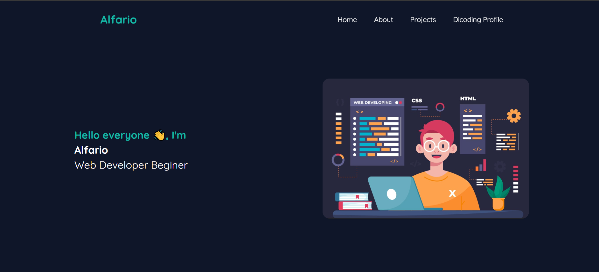
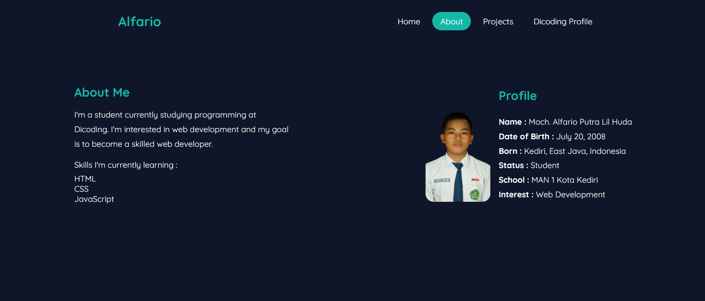
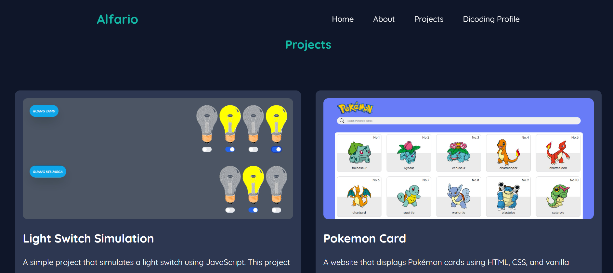
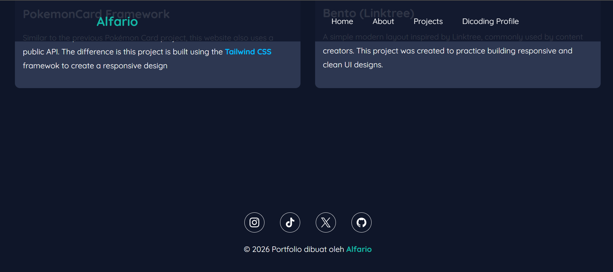

# Ujian-Akhir-Dicoding
Tugas akhir dicoding kelas Belajar ***Pemrograman Dasar Web***, membuat web portfolio sederhana menggunakan HTML & CSS

**PREVIEW**

**LINK =>** https://alfario207.github.io/Ujian-Akhir-Dicoding/